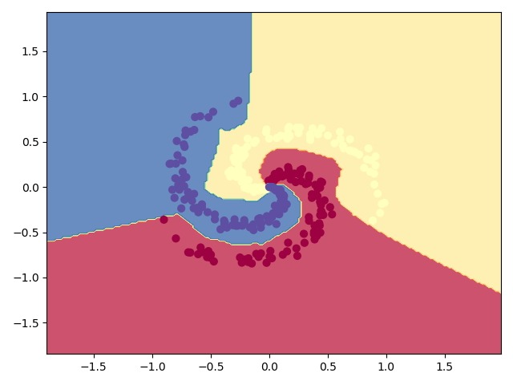
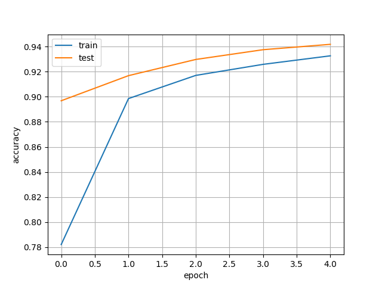
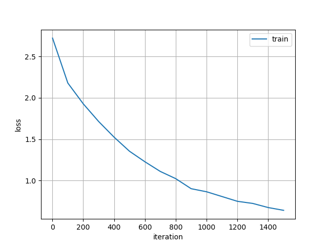
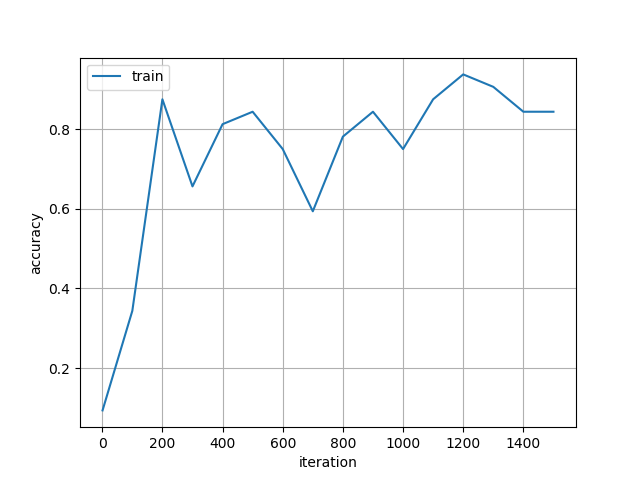
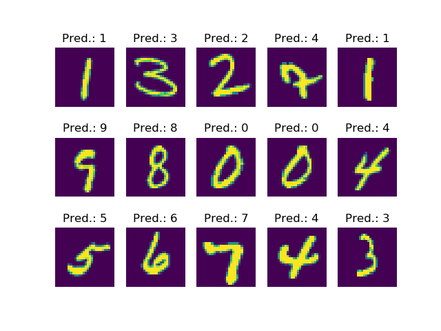

# Neural Network Basics
This repo contains a basic implementation of a neural network for own learning purposes implemented completely in numpy. This means, that the implementation is not as efficient as other libraries of course, but should implement some important papers in an intuitive and easy to read way.

## Done
- Fully-connected layer
- Initializations (Xavier, He)
- Activations (ReLu, Tanh, Sigmoid)
- Loss-functions (Cross entropy, MSE)
- SGD
- Convolutional layer (2D)
- Max-Pooling (2D)

## WIP
- More optimizers: AdaGrad, RMSProp, Adam, Lazy-Adam
- Average-Pooling
- Batch-Norm, Layer-Norm
- Dropout

## Future
- RNN / LSTM
- Attention mechanisms
- Unpooling

## Examples
In the following scripts are basic example tasks, which can be solved by the neural network:
- [Basic classification with a FCN](basic_classification.py)
- [Basic regression with a FCN](basic_classification.py)
- [MNIST classification with a CNN (full dataset)](conv_mnist_classification_full.py)
- [MNIST classification with a CNN (specific iterations)](conv_mnist_classification_simple.py)

To reproduce, simply run the scripts. But be *warned*, that some of the tasks may take a while to complete.

### Results of the example tasks

#### Basic classification task with a FCN
Classification of spiral formed toy data with a two-layered fully connected network.
This task is similar to 'https://cs.stanford.edu/people/karpathy/cs231nfiles/minimal_net.html'

Result:

#### Basic regression task with a FCN
The regression task tries to simulate a sine curve with a two layer FCN and learns with examples in the range from 0 to 10.

Result:

#### MNIST Classification with a CNN
Train a simple CNN with a 7x7 Convolutional Layer, 4x4 Max-Pooling, and two FC-Layers on MNIST to classify single digits between 0 and 9.

##### Full training
The full training provides a script to train the CNN on multiple epochs over the full dataset with minibatches. 
Since the network runs completely on NumPy, the training is of course much slower than real frameworks for Machine Learning (i.e. PyTorch or Tensorflow) need for this task.
However, the task is designed to be equal to a beginner TensorFlow 2 tutorial ('https://www.tensorflow.org/tutorials/quickstart/advanced').

Results:

| Loss | Accuracy |
| --- | --- |
|  |  |

| Example predictions |
| --- |
|  |

| Epoch | Train Loss | Train Accuracy | Test Loss | Test Accuracy |
| --- | --- | --- | --- | --- |
| 1 | 0.9847 | 78.201% | 0.4840 | 89.682% | 
| 2 | 0.4109 | 89.858% | 0.3311 | 91.688% | 
| 3 | 0.3113 | 91.708% | 0.2711 | 92.980% | 
| 4 | 0.2669 | 92.589% | 0.2323 | 93.760% | 
| 5 | 0.2388 | 93.271% | 0.2119 | 94.189% | 

##### Small training (simple)
The simpler version of the script, enables training on a specified number of iterations on the shuffled dataset with minibatches. 
Even if it is of course not as fast as the real frameworks, you can see results earlier than in the full version.

Results:

| Loss | Accuracy |
| --- | --- |
|  |  |

| Example predictions |
| --- |
|  |
